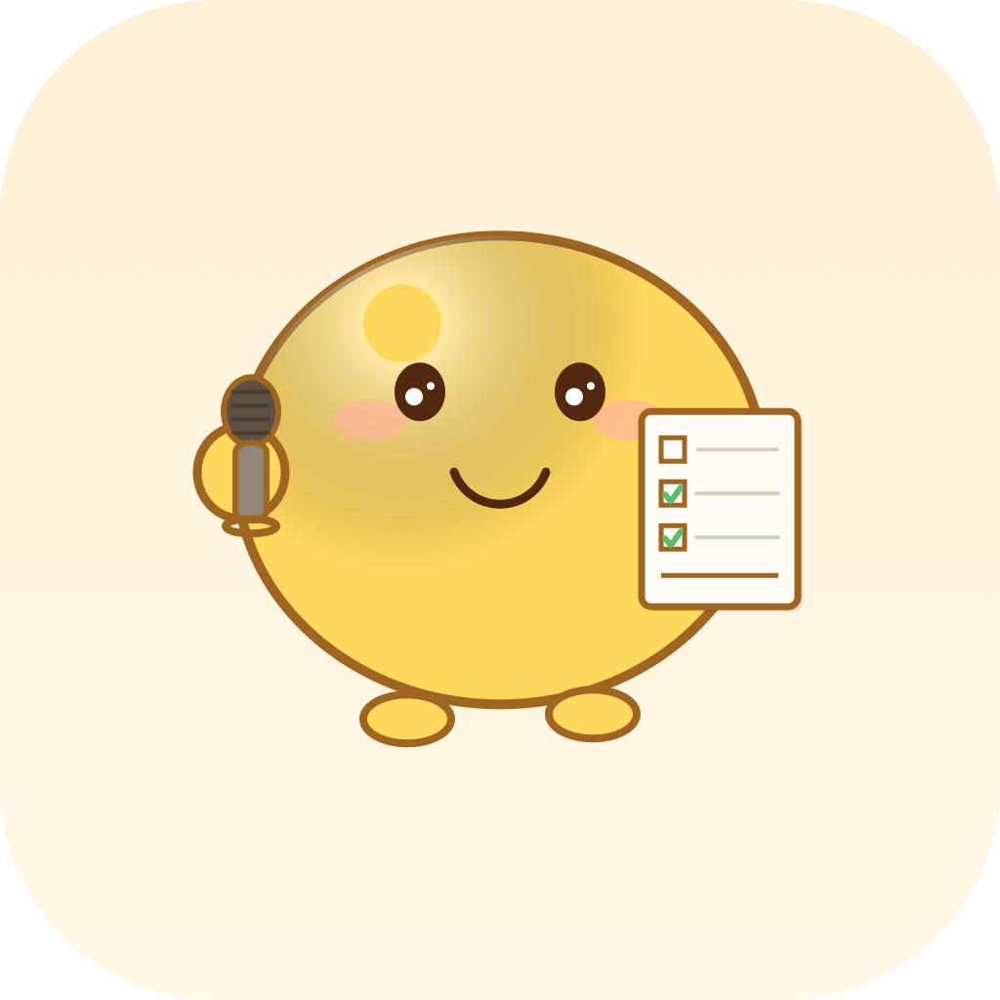

# 小豆语音待办 📝🎤

<p align="center">
  
</p>

<p align="center">
  
  
  
</p>

> 说话就能加待办，一键搞定所有事

一个温暖治愈的 iOS 语音待办 App，按住说话自动转文字，智能拆分多条待办，设置提醒时间推送到系统通知。灵感来自「小豆写日记」，采用奶油黄温暖设计风格。

## ✨ 特性

- 🎙️ **一键语音输入** — 按住麦克风说话，松手自动识别转文字
- 🧠 **智能拆分多条待办** — 一句话说多件事，自动识别拆分成独立待办
- 📅 **日期智能识别** — 自动识别"明天下午3点"、"下周一"等自然语言时间
- 🔔 **系统通知提醒** — 到点推送本地通知，不会错过待办
- ⌨️ **物理按键支持** — 通过快捷指令绑定 iPhone 操作按钮，任何界面一键唤起录音
- ✏️ **编辑功能** — 随时修改待办内容和提醒时间
- ✅ **完成勾选** — 点一下圆圈标记完成，滑动删除更快捷
- 🎨 **奶油黄温暖UI** — 治愈系配色，圆角卡片设计，使用心情都变好
- 🔒 **隐私优先** — 所有数据本地存储，语音识别优先设备端处理，不上传云端

## 📱 系统要求

- iOS 17.0+ (推荐 iOS 18 / iOS 26 获得最佳体验)
- Xcode 16+ 编译
- 麦克风和语音识别权限

## 🚀 安装方法

### 方法一：自行编译（推荐）

这是最简单的免费方式，不需要App Store：

1. 安装 [Xcode](https://apps.apple.com/cn/app/xcode/id497799835) （Mac App Store 免费下载）
2. 克隆项目
```bash
git clone https://github.com/isdou/TodoVoice.git
cd TodoVoice
```
3. 双击打开 `TodoVoice.xcodeproj`
4. 在左侧项目设置 → Signing & Capabilities → 选择你的Apple ID（免费账号即可）
5. 连接你的iPhone，在「设置 → 隐私与安全性 → 开发者模式」中打开开发者模式
6. 按 `Cmd+R` 编译运行，App就会安装到你的手机上
7. 首次打开需要在「设置 → 通用 → VPN与设备管理」中信任你的开发者证书

> 免费账号签名有效期7天，过期后重新连接Xcode运行一次即可。

### 方法二：AltStore / SideStore 侧载

如果你不想用Xcode，可以用AltStore/SideStore侧载ipa文件：
- 下载最新的ipa文件从 [Releases](https://github.com/isdou/TodoVoice/releases) 页面
- 使用AltStore签名安装到手机
- 同样7天需要重新签名一次

### 方法三：TestFlight

如果有TestFlight测试链接会发布在这里：（即将推出）

## ⌨️ 设置操作按钮（推荐配置）

配置后任何界面都能一键唤起录音：

1. 打开「设置」→「操作按钮」
2. 滑动选择「快捷指令」
3. 选择「录制语音待办」
4. 现在任何界面长按操作按钮就能直接说话添加待办啦！

也可以在锁屏、控制中心添加这个快捷指令。

## 🏗️ 项目结构

```
TodoVoice/
├── App/
│   └── TodoVoiceApp.swift       # 应用入口
├── Models/
│   └── TodoItem.swift           # SwiftData 待办模型
├── Services/
│   ├── TodoParser.swift         # 智能文本解析 & 日期提取
│   ├── SpeechRecorder.swift     # 语音录制 & Apple Speech 识别
│   └── NotificationManager.swift # 本地通知调度
├── Views/
│   ├── ContentView.swift        # 主界面 & 录音Sheet
│   ├── TodoEditView.swift       # 编辑待办页面
│   └── XDTheme.swift            # 奶油黄设计系统
└── Intents/
    └── RecordTodoIntent.swift   # App Intents 快捷指令支持
```

## 🛠️ 技术栈

- **SwiftUI** + **SwiftData** - 原生现代UI框架和数据持久化
- **Speech Framework** - Apple官方语音识别，支持设备端离线识别
- **App Intents** - iOS原生快捷指令集成
- **UserNotifications** - 本地通知提醒
- **NaturalLanguage** - 自然语言处理智能拆分待办

## 🎨 设计特点

- 奶油黄温暖渐变背景 `#FFF5DB → #FFFDF2`
- 金黄色主色调按钮，胶囊大圆角设计
- 卡片式布局，柔和暖阴影
- 全圆角字体 (Rounded Design)，更友好可爱
- 时间自适应问候语，早上好/下午好/晚上好自动切换
- Loading状态清晰可见，不会让用户疑惑发生了什么

## 📝 更新日志

### v1.0 (2025-07-25)
- 🎉 首个版本发布
- 语音转文字自动创建待办
- 智能拆分多条待办 + 自然语言日期识别
- 系统本地通知提醒
- App Intents 快捷指令支持，支持操作按钮
- 奶油黄温暖Lifelogs风格UI
- 待办编辑、删除、完成功能
- 录音处理loading状态优化

## 🤝 贡献

欢迎Issue和PR！

## 📄 License

MIT License - 详见 LICENSE 文件

---

Made with ❤️ using SwiftUI
